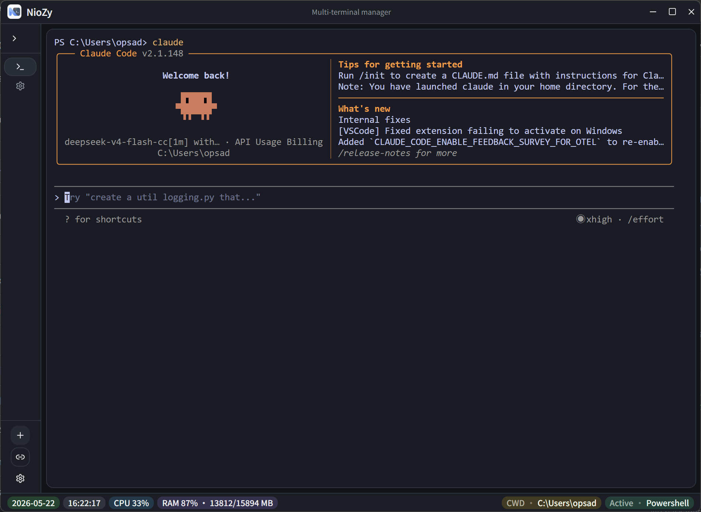
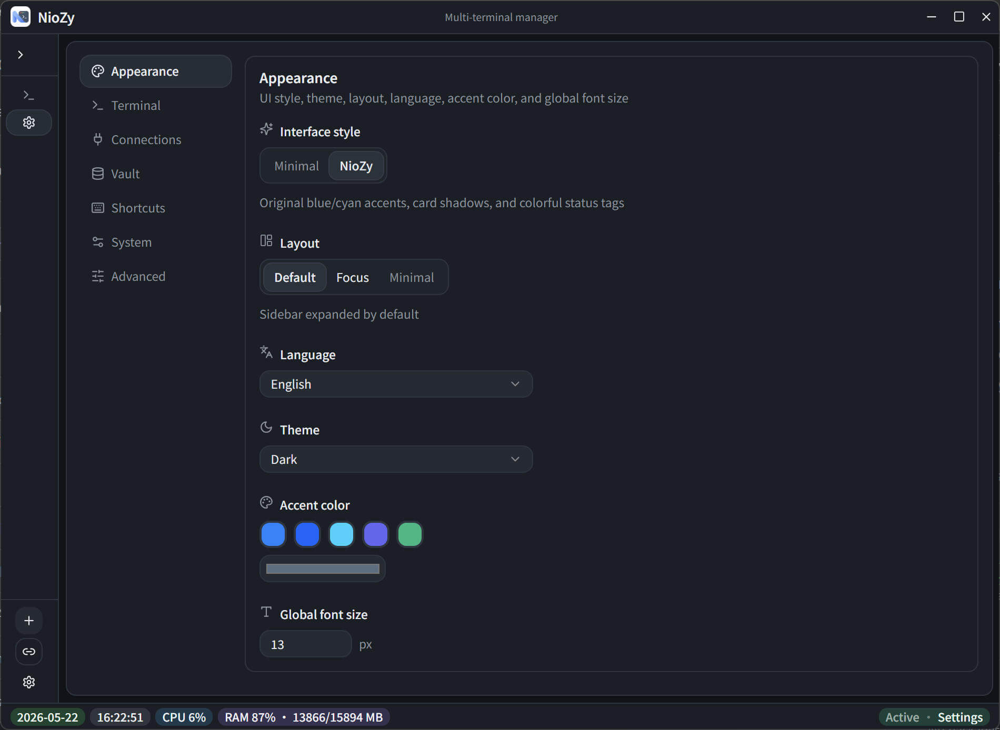
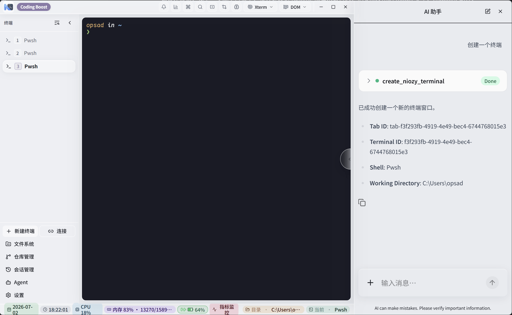
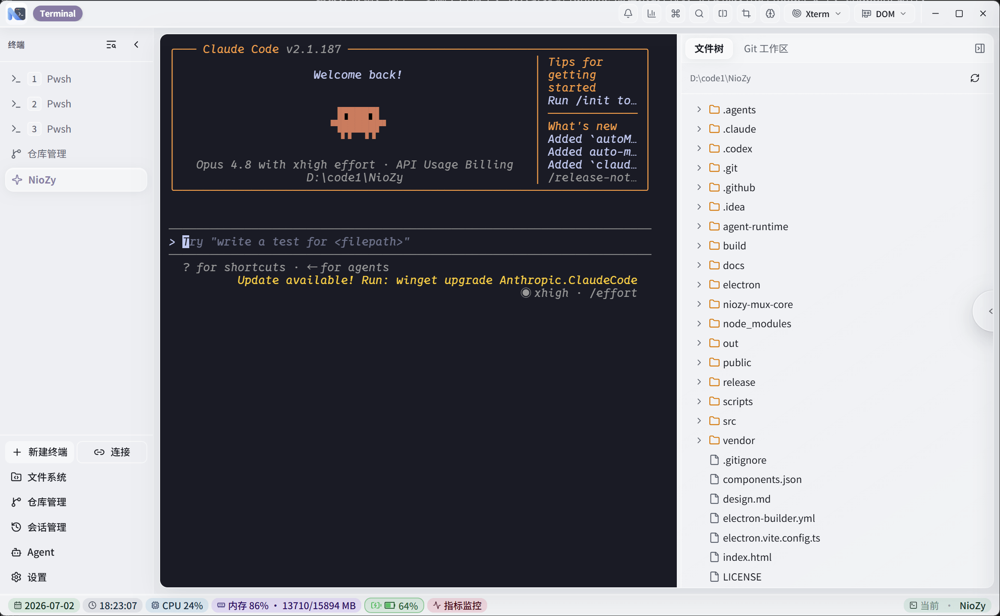
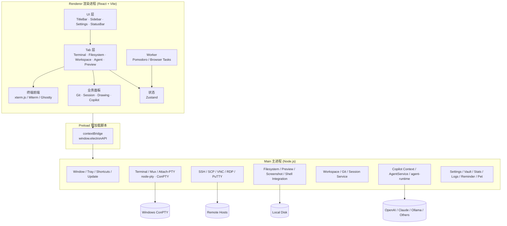

# NioZy

内置 AI 与 Agent 工作流的 Windows 本地终端工作台，基于 Electron 构建，围绕终端、多工作区、文件系统、预览与本地协作场景设计。









## 定位

NioZy 不是单一终端壳，而是一套围绕本地开发工作流组织的桌面工作台：

- 终端、SSH、SCP、Attach-PTY、Mux 等会话能力统一收口到同一个 Tab 系统
- Workspace 用于在指定目录里启动 Claude Code、Open Code、Pi Agent、Cursor Agent 等工具
- 内置 NioZy Agent，可在独立 Tab 中结合项目目录、模型配置与 `@文件` 引用完成对话式工程任务
- 文件系统、Markdown、绘图、WebView、媒体预览、截图、提醒、统计等外围能力直接与主工作台集成

## 功能概览

### 终端与会话

- **多 Tab / 多 Pane 终端**：本地 PowerShell、CMD、pwsh、SSH 与自定义连接统一管理
- **双终端渲染路径**：默认 xterm.js，实验区提供 Wterm / Ghostty / Mux 相关能力
- **Attach-PTY 渲染模式**：复用外部 PTY，支持滚动回放卸载、活跃输出门控与切换驻留策略
- **会话恢复**：本地终端支持重启后恢复 Tab / Pane 布局与上下文
- **Shell 集成**：工作目录同步、资源管理器右键打开、管理员权限重启

### AI、Agent 与 Workspace

- **NioZy Agent**：独立 Agent Tab，主进程调度 Go `agent-runtime`，支持流式回复、模式切换、停止生成与 Markdown 渲染
- **`@文件` 引用**：Agent 输入框支持按文件名搜索工程文件，并在发送时把文件内容注入上下文
- **AI Copilot 侧栏**：支持规则、技能、附件与前端工具调用开关
- **Workspace**：在指定目录启动 Claude Code、Open Code、Pi Agent、Cursor Agent 等工具终端
- **Workspace Git 面板**：在工作区内查看分支、状态、Diff，并执行定向提交 / Push
- **会话管理**：可读取并展示 Claude Code、Open Code 等外部 AI 编码工具的历史会话入口

### 文件、仓库与预览

- **本地文件系统 Tab**：浏览目录、收藏路径、Git 仓库识别、外部编辑器打开
- **统一预览路由**：Markdown、代码、图片、视频、Office、PDF、网页链接按类型进入对应预览 Tab
- **Markdown 编辑**：内置 Markdown 编辑与预览能力
- **绘图 Tab**：集成 Excalidraw 与 Draw.io
- **仓库管理**：本地仓库列表、分支与变更视图集成在文件系统 / 工作区流程里

### 连接、协作与桌面工具

- **SSH / SCP**：保存连接信息、认证方式与传输任务
- **连接管理**：支持 RDP、PuTTY、VNC 与自定义连接入口
- **P2P 聊天**：局域网加密文本与文件传输
- **截图工具**：区域截图、标注与剪贴板流转
- **提醒事项 / 番茄钟 / 桌面宠物**：围绕专注工作流的桌面工具

### 界面与系统能力

- **自定义标题栏与布局**：支持动态标题、布局模式切换、侧栏与顶部栏控制
- **多主题与外观配置**：主题、字体、终端背景、视觉风格集中配置
- **全局快捷键**：新建终端、切换 Tab、分屏等操作可配置
- **托盘与系统集成**：托盘、开机启动、关闭最小化到托盘、更新检查
- **使用统计与日志**：本地统计使用行为，并提供应用日志等级与目录设置

## 设置中心

设置中心当前按以下分区组织能力：

- 外观设置
- 终端设置
- SSH
- SHELL
- 预览
- 性能
- 文件系统
- 绘图功能
- Markdown 编辑
- 连接设置
- 存储库
- 快捷键
- 使用统计
- 提醒设置
- 辅助功能
- 系统设置
- 加密通信
- AI 特性
- 管理会话
- 工作区
- NioZy Agent
- 日志设置
- 高级设置
- 实验特性

更细的模块说明见 [docs/README.md](./docs/README.md)。

## 架构



### 进程职责

| 层级 | 目录 | 职责 |
|------|------|------|
| Main | `electron/main/`、`electron/*.ts` | 窗口、托盘、PTY、SSH、文件系统、Git、Agent、设置持久化 |
| Preload | `electron/preload/` | 暴露安全的 `electronAPI`，负责 IPC 多路复用 |
| Renderer | `src/` | React UI、Tab 系统、终端容器、设置面板、业务状态 |
| Shared | `electron/shared/` | 主渲染共享类型、默认值、设置模型 |
| Worker | `src/workers/`、`electron/workers/` | 计时、后台任务与部分隔离执行逻辑 |

### 关键路径

- **终端链路**：`TerminalView` / `terminal store` -> `electronAPI.terminal.*` -> `electron/terminal-service.ts`
- **Workspace 链路**：`WorkspacePanel` / `workspace-store` -> `electronAPI.workspace.*` -> `electron/workspace-service.ts`
- **Agent 链路**：`AgentPanel` / `agent-store` -> `electronAPI.agent.*` -> `electron/agent-service.ts` -> `agent-runtime`
- **设置链路**：设置面板 -> `settings-store` -> `electron/settings-store.ts` 持久化与迁移

## 技术栈

| 类别 | 技术 |
|------|------|
| 桌面壳 | Electron 42、electron-vite、electron-builder |
| 前端 | React 19、TypeScript、Tailwind CSS 4 |
| UI 组件 | Radix UI、shadcn/ui 风格本地组件、Lucide |
| 终端 | xterm.js 6、@xterm/addon-webgl、node-pty、@wterm/*、ghostty-web |
| 状态管理 | Zustand |
| 远程连接 | ssh2、basic-ftp、VNC / RDP / PuTTY 相关桥接 |
| 编辑与预览 | CodeMirror、Mermaid、KaTeX、js-preview、Mammoth、XLSX |
| 绘图与多媒体 | Excalidraw、Draw.io、Three.js |
| AI | CopilotKit、Go `agent-runtime`、多提供商模型配置 |

## 开发

```bash
npm install
npm run dev
```

`npm run dev` 会先准备图标与本地 vendor 资源，再启动 Electron 开发环境。不要直接把它当纯 Vite 页面在浏览器中打开，因为很多能力依赖预加载 API 和主进程服务。

常用脚本：

```bash
npm run typecheck      # TypeScript 检查
npm run build          # 构建 main / preload / renderer
npm run preview        # 预览构建结果
npm run dist           # 构建 Windows 安装包
npm run dist:dir       # 输出未打包目录
npm run analyze:asar   # 分析 asar 体积
```

资源准备相关脚本：

```bash
npm run generate:icon
npm run vendor:drawing
npm run vendor:oh-my-posh
```

如果需要构建本地 Agent 可执行文件：

```bash
npm run build:agent
npm run copy:agent
```

## 配置与数据

应用配置目录位于 `%USERPROFILE%\.config\NioZy\`。常见内容包括：

- `settings.json`：应用设置
- `vault.json` / `niozy.key`：存储库变量与加密密钥
- `chat/`：P2P 聊天历史与设备身份
- `reminder/`：提醒事项数据
- `pets/`：桌面宠物资源
- `ai/rules/`、`ai/skills/`：AI 上下文规则与技能

AI 与 Agent 配置已拆分为独立设置块：

- `settings.ai`：AI 侧栏、模型、工具调用、上下文能力
- `settings.agent`：NioZy Agent 开关、日志、`maxTokens` 与 runtime 相关配置

实验性终端与渲染选项仍位于 `settings.experimental`。

## 文档

- 总索引：[docs/README.md](./docs/README.md)
- Agent 说明：[docs/功能Agent.md](./docs/功能Agent.md)
- Workspace：[docs/功能工作区.md](./docs/功能工作区.md)
- AI 助手边栏：[docs/功能AI助手边栏.md](./docs/功能AI助手边栏.md)
- 终端与会话：[docs/功能终端与会话.md](./docs/功能终端与会话.md)
- 文件系统：[docs/功能文件系统.md](./docs/功能文件系统.md)

## 构建与发布

```bash
npm run dist
```

发布流程由 [`.github/workflows/release.yml`](./.github/workflows/release.yml) 驱动。推送 Tag 后会自动解析版本号、构建 Windows 安装包并上传到 GitHub Release。

```bash
git push origin master
git tag 2.0.18
git push origin 2.0.18
```

## 许可证

Apache-2.0
